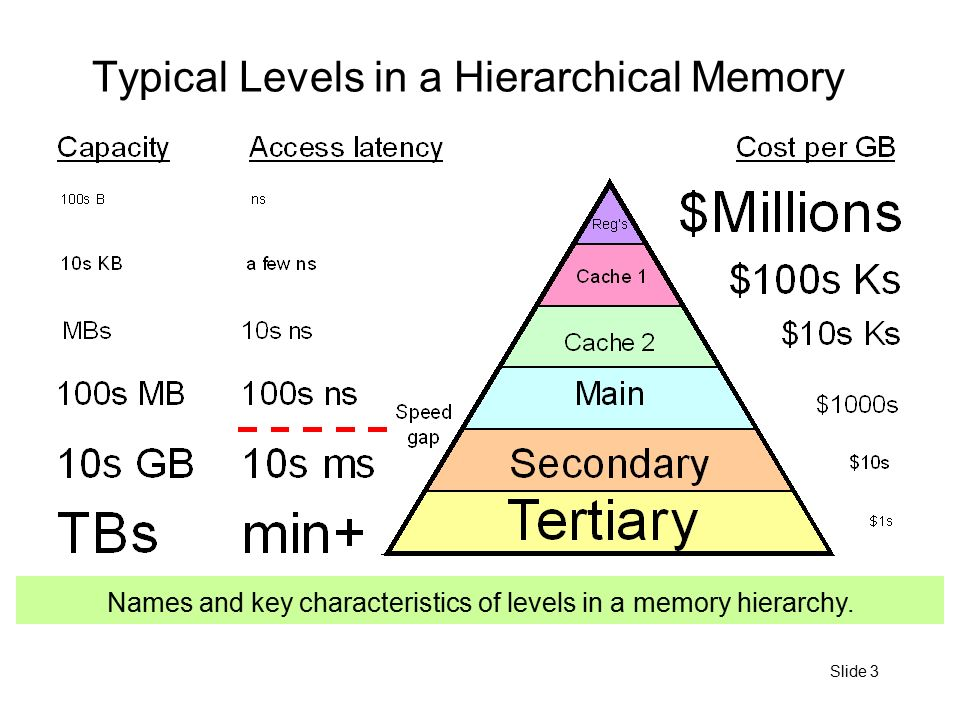
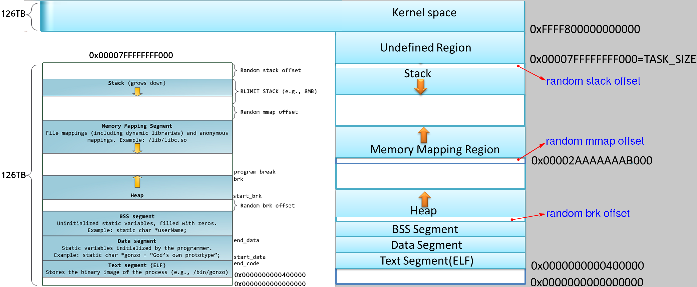
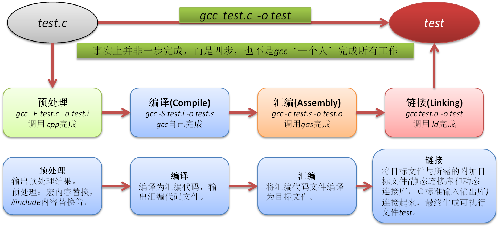

# 计算机体系结构
参考:
- [深入理解计算机系统v3]

计算机的三个根本性基础:
1. 计算机是输入, 运算, 输出的机器
1. 程序是指令和数据的集合
1. 计算机的处理方式有时与人的思维方式不一致 : 比如计算机处理的一切皆是数字.

> 机器语言是二进制语言, 是计算机可以直接识别的语言. 汇编是机器语言的助记符.
> 计算机系统中的所有信息皆是数值, 区分这些数值含义的唯一方法是了解信息的上下文.

程序的三种流程:
1. 顺序
1. 条件分支
1. 循环

面向对象三要素:
- 继承 : 通过继承已存在的类所拥有的成员而生成新的类
- 封装 : 在类所拥有的成员中,隐藏掉那些没有必要展现给该类调用者的成员
- 多态 : 针对同一种消息,不同的对象可以进行不同的操作

> 类是对象的定义,而对象是类的实例(Instance)

## 硬件
计算机构成:
1. 总线
    总线是计算机多个系统功能部件之间进行数据传送的公共通路,比如主板上密密麻麻的线路.
    总线按系统总线传输信息的不同可分为三类：数据总线、地址总线和控制总线
1. I/O设备
    系统与外部的联系渠道

    每个I/O设备都是通过控制器或适配器与I/O总线相连. 控制器或适配器的区别主要在于封装方式:  控制器是设备本身或主板上的芯片组; 适配器是主板插槽上的扩展卡
1. 内存
    可以看成一个线性的Byte数组
1. CPU
    指令集描述机器代码指令的效果
    处理器的微体系结构描述处理器是如何实现的

DMA(直接存储器存取) : 设备独立地直接读写系统内存，而不需中央处理器（CPU）介入处理.




## 操作系统
功能:
1. 防止应用直接访问硬件导致损坏
1. 管理系统资源

抽象:
- 指令集是cpu的抽象
- 文件系统是I/O设备的抽象
- 虚拟内存是内存和磁盘i/O设备的抽象
    它为每个进程提供一个假象: 每个进程能独占整个内存. 其地址空间称为虚拟地址空间, 空间的最上面(地址高位处)是内核空间, 所有进程都一样且对用户代码不可见
- 进程是cpu, 内存, I/O设备的抽象
- 虚拟机是操作系统的抽象

OS保持跟踪的进程运行所需的所有状态信息成为上下文, 因此其实现的进程切换执行的机制叫上下文切换.

大端和小端:
- Little-Endian : 低位字节排放在内存的低地址端，高位字节排放在内存的高地址端, 数值描述形式与内存地址增长方向相反. 比如intel cpu, **主流**.
- Big-Endian : 高位字节排放在内存的低地址端，低位字节排放在内存的高地址端, 数值描述形式与内存地址增长方向一致. 比如Sun的SPARC.

> 部分cpu支持双端, 但一旦选定os, 其使用的字节序也就固定了. 比如使用arm的Android, iso都使用小端模式.
> 大小端影响: 1. 不同端机器的网络传输(可依照网络传输标准解决) 2. 汇编代码的阅读

### [Linux x64虚拟地址布局](https://www.kernel.org/doc/Documentation/x86/x86_64/mm.txt)
参考:
- [虚拟内存[00] 虚拟内存地址空间](https://durant35.github.io/2017/11/06/VM0_AddressSpace/)
- [Linux X86_64位虚拟地址空间布局与试验](https://blog.csdn.net/Wu_Roc/article/details/77203480)
- [内存-用户空间](https://jin-yang.github.io/post/kernel-memory-management-from-userspace-view.html)

在x86_64下面，虚拟地址空间最大为16EB, 但其实际只使用了48位, 所以C程序里打印的地址都是只有12位16进制, 48位地址长度也就是对应了256TB的地址空间.

> `gcc -m32 main.c`兼容32/64位, `gcc -m64 main.c`仅支持64位, 即由该程序如何编译决定其支持什么样的机器.

而在Linux下有效的地址区间是从 `0x00000000 00000000 ~ 0x00007FFF FFFFFFFF` 还有 `0xFFFF8000 00000000 ~ 0xFFFFFFFF FFFFFFFF` 两个地址区间, 而每个地址区间都有128TB的地址空间可以使用，所以总共是256TB的可用空间. 地址空间的划分就如下所示:
```text
    ffffffff ffffffff     _____________   
                          |            |   
                          |   内核空间  |   
    ffff8000 00000000     |____________|   
                          |            |   
                          |   未使用    |   
                          |   的空间    |   
                          |            |   
    00007fff ffffffff     |____________|   
                          |            |   
                          |   用户空间  |   
    00000000 00000000     |____________|
```



> 经典内存布局方式的不足(本质是32位地址空间有限): 32经典内存布局下, 进程的栈从地址0xc0000000（3G）向低地址发展，同时内存映射区域从0×40000000（1G）向高地址发展. 因为栈所用内存相对较小(通常小于100MB, 可通过`ulimit -s`查看栈的默认大小, 默认是`8M`)，因此约有2GB左右的映射空间; 进程堆的起始点大于BSS段的结束点，并向高地址发展，因为0×40000000以上已用作内存映射用，因此堆的大小只有约1G, **空间不足**.
> 空间默认布局与经典布局的区别: MMAP 区域的增长方向, 由`vm.legacy_va_layout`控制, 推荐使用默认布局. 默认布局让栈空间的固定，而堆区域和 MMAP 区域公用一个空间，这在很大程度上增长了堆区域的大小, 但弥补了经典内存布局方式的不足.
> ASLR，全称为 Address Space Layout Randomization，地址空间布局随机化,由`kernel.randomize_va_space`控制. 它将进程的某些内存空间地址进行随机化来增大入侵者预测目的地址的难度，从而降低进程被成功入侵的风险, 主要防止缓冲区溢出攻击.
> ASLR 不负责代码段以及数据段的随机化工作，由 PIE 机制(在编译时开启) 负责. 但是只有在开启 ASLR 之后，PIE 才会生效.
> 查看可执行程序有没有开pie可通过`readelf -l xxx`查看,对应如下:
    Elf 文件类型为 DYN (共享目标文件) ===> 对应开启了pie
    Elf 文件类型为 EXEC (可执行文件)  ===> 对应未开启pie
>　内核中有两个参数会影响内存的布局：`vm.legacy_va_layout`和`kernel.randomize_va_space`.

一个程序的内存布局，可以通过以下命令查看:
```sh
$ cat /proc/<pid>/maps
$ pmap <pid> -X
```

> [vDSO](http://man7.org/linux/man-pages/man7/vdso.7.html)全称是virtual dynamic shared object，是一种内核将一些本身应该是系统调用的直接映射到用户空间，这样对于一些使用比较频繁的系统调用，直接在用户空间调用可以节省开销.

## 并发/并行
并发是时间段概念; 并行是时刻概念.

实现方式:
1. 线程级并发
    1. 多核
    1. 超线程
1. 指令级并行
1. 单指令, 多数据并行(SIMD)
    多用于多媒体

## 进制
数值 ＝ 该数值各数位的数值 × 基数的若干幂次(即位权):
```
(1010.1)10 = 1×10^3+ 0×10^2+ 1×10^1+ 0×10^0 + 1*10^-1
(1010)2 = l×2^3 + 0×2^2+ l×2^1+0 × 2^0 = (10)10
```

### X进制转二进制
整数部分: 除基取余法, 用基数相除, 然后反序取余数
小数部分: 乘基取整法, 用基数相乘, 然后正序取整数

X进制加减乘除与十进制类似.

### 原/反/补码

负数的反码 = 在其原码的基础上, 符号位不变，其余各个位取反 = 该值的绝对值取反
负数的补码 = 负数的反码 + 1
负数的原码 = 在其补码的基础上, 符号位不变，其余各个位取反 + 1

> [+1] = [00000001]原 = [00000001]反 = [00000001]补
> [-1] = [10000001]原 = [11111110]反 = [11111111]补

### 计算机减法
计算机辨别"符号位"显然会让计算机的基础电路设计变得十分复杂, 于是人们想出了将符号位也参与运算的方法(通过是否溢出来取舍计算结果的符号位).

为了解决原码做减法的问题, 出现了反码:
```
1 - 1 = 1 + (-1) = [0000 0001]原 + [1000 0001]原= [0000 0001]反 + [1111 1110]反 = [1111 1111]反 = [1000 0000]原 = -0
```

但是`[0000 0000]原 = +0`也表示`0`, 而补码的出现解决了0的符号以及两个编码的问题:
```
1-1 = 1 + (-1) = [0000 0001]原 + [1000 0001]原 = [0000 0001]补 + [1111 1111]补 = [0000 0000]补=[0000 0000]原
```

计算机使用加法来实现减法运算的数学原理: 同余
```
两个整数a，b，若它们除以整数m所得的余数相等，则称a，b对于模m同余
记作 a ≡ b (mod m)
读作 a 与 b 关于模 m 同余
```

假设模长就是m=2^N(N=8,16,32,64,即计算机整数的比特长度):
```
a-b = a+m-b = a + (m-1-b+1) = a + (~b+1)
m - 1 =  2^N -1 => (2^N -1) - b = ~b // 即全是1的序列中扣除b, 正好是~b
```

### 类型
C数据类型的大小 :　现今所有64位的类Unix平台均使用LP64数据模型，而64位Windows使用LLP64数据模型. 但为了避免依赖OS的数据模型和编译器决定数值长度的怪异行为, **iso c99引入了[固定长度的数值类型即Fixed width integer types, 在stdint.h里](https://en.cppreference.com/w/c/types/integer), 推荐使用**.

> 整型类型转换时, 仅转换变量类型, **原先类型底层存储的补码不变** 

### 移位
左移不区分逻辑算术 : 移出去的位丢弃，空缺位（vacant bit）用 0 填充

右移:
- 逻辑 : 移走的位填充为0
- 算术(编译器默认) : 移走的位填充与符号位有关，如果为负数，则移走的位填充为1.

符号扩充 : 在保持数值不变的前提下扩充类型长度(int16->int32), 只需要用符号位填充高位即可.

> 移位运算时常用`()`解决优先级问题.

### 计算机小数运算出错误的原因
有一些十进制的小数无法转换成二进制数,转化后只能得到近似值, 比如`0.1`.

避免方法: 先换算成整数, 计算后再转回去

### 浮点(IEEE 754)
参考:
- [解析IEEE 754 标准](https://www.cnblogs.com/HDK2016/p/10506083.html)


浮点数 = 符号位（sign bit）* 2^指数偏移值(exponent bias) * `1.fraction`
浮点数存储格式(32/64): 符号位（sign bit, 1）+ exponent(指数, 8/11) + `fraction`(尾数, 23/52)

> 指数偏移值(采用Excess系统表现, 长度为8/11) : exponent - 偏移量(127/1023) = 阶码(指明了小数点在数据中的位置,即左移/右移多少位)
> 尾数格式`1.fraction`(将小数点前的值固定为1的表达式,其中小数部分fraction为计算机实际存储的内容, 长度为23/52)

## 编译
参考:
- [GCC编译过程详解](http://chengqian90.com/C%E8%AF%AD%E8%A8%80/GCC%E7%BC%96%E8%AF%91%E8%BF%87%E7%A8%8B%E8%AF%A6%E8%A7%A3.html)

编译是指将使用高级语言编写的源代码转换成机器语言的过程, 其中用于转换的工具被称为编译器(compiler).
> 函数调用会转换成`call`指令, 函数结束的处理则会转换成`return`指令

编译的四个阶段:
1. 预处理
    C/C++源文件中，以#开头的命令被称为预处理命令，如"#include"、宏定义命令"#define"、条件编译命令"#if、#ifdef"等.

    预处理是将包含(include)的文件插入原文件中、将宏定义展开、根据条件编译命令选择要使用的代码，最后将这些东西输出到一个.i文件中并等待进一步处理. 因此能在这一步检查宏定义和头文件是否正确
1. 编译
    编译器把C/C++代码(比如上述的.i文件)翻译成汇编代码, 即把预处理完的文件进行一系列词法分析、语法分析、语义分析及优化后生成相应的汇编代码文件. 这个过程是整个程序构建的核心部分，也是最复杂的部分之一
1. 汇编
    汇编器将编译器输出的汇编代码翻译成符合一定格式的机器代码，在Linux系统上一般表现为ELF目标文件(OBJ文件即`.o`文件)
1. 链接
    将汇编器生成的OBJ文件和系统库的OBJ文件、库文件链接起来，最终生成可以在特定平台运行的可执行文件

    连接器的任务之一是为函数调用找到匹配的函数的可执行代码的位置.

, 可通过`gcc -v main.c`的编译日志详细了解.

为什么要了解编译器如何工作:
- 优化程序性能 : 比如switch语句是否总是比一系列的if-else高效?
- 理解链接时出现的错误
- 避免安全漏洞 : 缓冲区溢出

include两种方式：
- `#include<>` : 引用的是编译器的类库路径里面的头文件
- `#include” “` : 引用的是程序目录的相对路径中的头文件

汇编代码:
```asm
	.file	"mstore.c"
	.text
	.globl	multstore
	.type	multstore, @function
multstore:
.LFB0:
	.cfi_startproc
	pushq	%rbx
	.cfi_def_cfa_offset 16
	.cfi_offset 3, -16
	movq	%rdx, %rbx
	call	mult2@PLT
	movq	%rax, (%rbx)
	popq	%rbx
	.cfi_def_cfa_offset 8
	ret
	.cfi_endproc
.LFE0:
	.size	multstore, .-multstore
	.ident	"GCC: (Debian 6.3.0-18+deb9u1) 6.3.0 20170516"
	.section	.note.GNU-stack,"",@progbits
```
`.xxx`是指导汇编器和链接器工作的伪指令, 通常可以忽略.

> gcc, objdump默认使用ATT格式的汇编；microsoft工具和intel的文档使用intel格式的汇编, [两者区别](http://timothyqiu.com/archives/difference-between-att-and-intel-asm-syntax/):
    1. 寄存器命名: 在 AT&T 汇编格式中要加上 '%' 作为前缀；Intel则不加
    1. 源/目的操作数顺序: AT&T 语法先写源操作数，再写目标操作数；Intel则相反
    1. 内存取址方式: AT&T 语法总体上是offset(base, index, width)的格式; Intel 语法总体上是[INDEX * WIDTH + BASE + OFFSET]的格式
    1. 操作数长度标识: AT&T 语法将操作数的大小表示在指令的后缀中（b、w、l）；Intel 语法将操作数的大小表示在操作数的前缀中（BYTE PTR、WORD PTR、DWORD PTR）
    1. 常数: AT&T 语法要在常数前加 `$`; Intel则不加

反汇编是指将机器代码转换为汇编代码，这在调试程序时常常用到. 比如使用`objdump -S file.o`查看`.o`文件的反汇编, 其内容描述如下:
1. 左侧第1列是地址偏移量
1. 左侧第2列是指令, x86_64指令是1~15字节. 常用指令/操作数较少的指令所需字节较少, 否则就较多
1. 左侧第3列是汇编代码, 等价于第2列的指令
    ```c
    // mstore.c
    long mult2(long, long);

    void multstore(long x, long y, long *dest) {
        long t = mult2(x,y);
        *dest = t;
    }
    ```
    `mult2(x,y)`在`mstore.s`里是`call	mult2@PLT`; 在`objdump -S mstore.o`时call里面只有相对位置`callq  27 <multstore+0x27>`(0x27是mult2在multstore中的相对位置); 在`objdump -S 完整程序`时为`callq  6ed <mult2>`(6ed是mult2可执行代码的位置)
1. 反汇编使用的指令命名与gcc生成的汇编代码有差别: 它省略了很多指令的后缀`q`, 且給call和ret指令添加了`q`后缀.