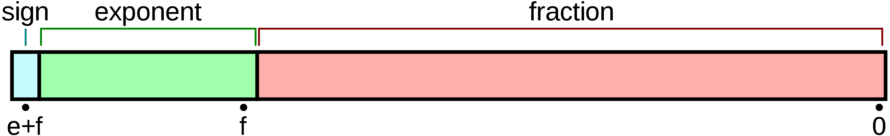

# 计算机体系结构
计算机的三个根本性基础:
1. 计算机是输入, 运算, 输出的机器
1. 程序是指令和数据的集合
1. 计算机的处理方式有时与人的思维方式不一致 : 比如计算机处理的一切皆是数字.

> 机器语言是二进制语言, 是计算机可以直接识别的语言. 汇编是机器语言的助记符.
> 计算机系统中的所有信息皆是数值, 区分这些数值含义的唯一方法是了解信息的上下文.

程序的三种流程:
1. 顺序
1. 条件分支
1. 循环

面向对象三要素:
- 继承 : 通过继承已存在的类所拥有的成员而生成新的类
- 封装 : 在类所拥有的成员中,隐藏掉那些没有必要展现给该类调用者的成员
- 多态 : 针对同一种消息,不同的对象可以进行不同的操作

> 类是对象的定义,而对象是类的实例(Instance)

## 进制
数值 ＝ 该数值各数位的数值 × 基数的若干幂次(即位权):
```
(1010.1)10 = 1×10^3+ 0×10^2+ 1×10^1+ 0×10^0 + 1*10^-1
(1010)2 = l×2^3 + 0×2^2+ l×2^1+0 × 2^0 = (10)10
```

负数的反码 = 在其原码的基础上, 符号位不变，其余各个位取反 = 该值的绝对值取反
负数的补码 = 负数的反码 + 1
负数的原码 = 在其补码的基础上, 符号位不变，其余各个位取反 + 1

> [+1] = [00000001]原 = [00000001]反 = [00000001]补
> [-1] = [10000001]原 = [11111110]反 = [11111111]补

### 计算机减法
计算机辨别"符号位"显然会让计算机的基础电路设计变得十分复杂, 于是人们想出了将符号位也参与运算的方法(通过是否溢出来取舍计算结果的符号位).

为了解决原码做减法的问题, 出现了反码:
```
1 - 1 = 1 + (-1) = [0000 0001]原 + [1000 0001]原= [0000 0001]反 + [1111 1110]反 = [1111 1111]反 = [1000 0000]原 = -0
```

但是`[0000 0000]原 = +0`也表示`0`, 而补码的出现解决了0的符号以及两个编码的问题:
```
1-1 = 1 + (-1) = [0000 0001]原 + [1000 0001]原 = [0000 0001]补 + [1111 1111]补 = [0000 0000]补=[0000 0000]原
```

计算机使用加法来实现减法运算的数学原理: 同余
```
两个整数a，b，若它们除以整数m所得的余数相等，则称a，b对于模m同余
记作 a ≡ b (mod m)
读作 a 与 b 关于模 m 同余
```

假设模长就是m=2^N(N=8,16,32,64,即计算机整数的比特长度):
```
a-b = a+m-b = a + (m-1-b+1) = a + (~b+1)
m - 1 =  2^N -1 => (2^N -1) - b = ~b
```

### 移位
左移不区分逻辑算术 : 移出去的位丢弃，空缺位（vacant bit）用 0 填充

右移:
- 逻辑 : 移走的位填充为0
- 算术 : 移走的位填充与符号位有关，如果为负数，则移走的位填充为1.

符号扩充 : 在保持数值不变的前提下扩充类型长度(int16->int32), 只需要用符号位填充高位即可.

### 计算机小数运算出错误的原因
有一些十进制的小数无法转换成二进制数,转化后只能得到近似值, 比如`0.1`.

避免方法: 先换算成整数, 计算后再转回去

### 浮点(IEEE 754)
参考:
- [解析IEEE 754 标准](https://www.cnblogs.com/HDK2016/p/10506083.html)



浮点数(32/64) = 符号位（sign bit）* 2^指数偏移值(exponent bias) * 尾数(fraction)

> 指数偏移值(采用Excess系统表现, 长度为8/11) : exponent - 偏移量
> 尾数格式(将小数点前的值固定为1的表达式,但fraction仅存储小数部分, 长度为23/52) : 格式化成1.xxx后存储xxx部分

## 编译
编译是指将使用高级语言编写的源代码转换成机器语言的过程, 其中用于转换的工具被称为编译器(compiler).

函数调用会转换成`call`指令, 函数结束的处理则会转换成`return`指令